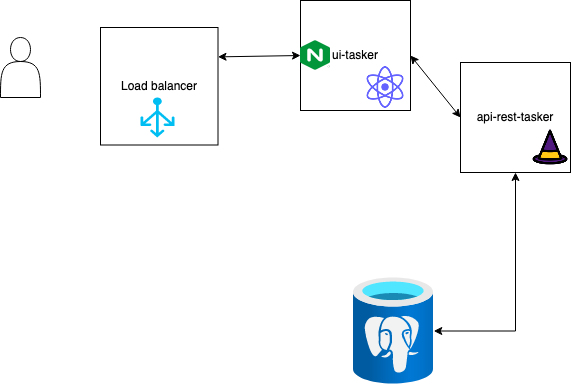

# simple-tasker

This is task manager system to help you organize your tasks in a simple and flexible way. It's a micro-service project with a graphical interface to visualize and add new tasks using a REST API backend and a database. 
It follows a microservice architecture with several containerized services and deployed in [Oracle cloud](https://cloud.oracle.com/), from now OCI.  
It aims to be highly scalable, performant and resilience.

## Architecture

Below there is an architectural diagram of the simple-tasker  project:



## Components

The project has two main components, a GUI with reactJS () and a REST API using dropwizard(https://www.dropwizard.io/en/latest). 

- Graphical user interface (react app) [ui-tasker](./ui-tasker/README.md).
- API REST (dropwizard) ([api-rest-tasker](./api-rest-tasker/README.md))

## Build and run the project locally

To build the different services you can use [docker-compose](https://docs.docker.com/compose/) and run the following:

```
docker-compose build
```

This will build both frontend and backend services for production and also a local dev containers. we use multi stage dockerfiles, more on [multistage-build](https://docs.docker.com/develop/develop-images/multistage-build/).


For running the tasker, simply run

```
docker-compose up app-fe
```

This will launch all required images to run ui, api rest, database and provisioners for development. To open the tasker and test, open ```http://localhost:3000``` in a browser.

You can connect to dropwizard backenc debug port 8888 depending on your IDE.

You can also test the rest api endpoints from the base url ```http://localhost:8080```; the different endpoints supported are described in  [endpoints](./api-rest-tasker/README.md#endpoints).

If you run ```docker-compose up app-be```, you will simply run the dropwizard api rest service.

### Run the production containers

Simply run ```docker-compose up ui-tasker```. This will launch the production container for frontend react and for backend dropwizard; it will also use the database and provision db service.


## deploy

The tasker is deployed in OCI

We will use liquibase to run database evolutions but not including directly in our dropwizard application. We think it's better to decouple the two components separately.
For liquibase we plan in use a Dockerfile to apply them.

### Healthchecks and Metrics

Include a prometheus collector and a prometheus transformer.https://github.com/RobustPerception/java_examples/tree/master/java_dropwizard
https://stackoverflow.com/questions/52931289/expose-prometheus-metrics-in-dropwizard

To see your applications health enter url `http://localhost:8081/healthcheck`.


